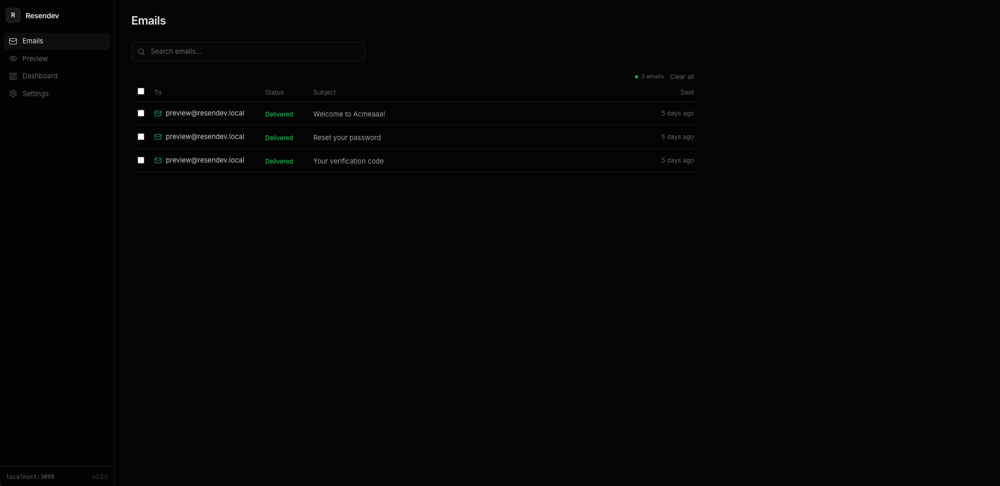
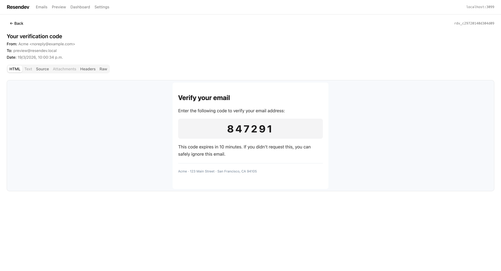
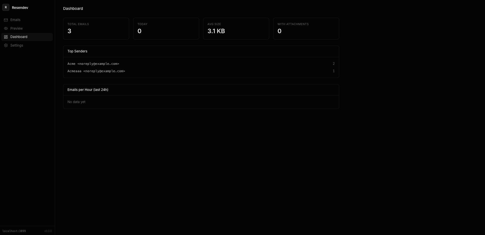

<p align="center">
  
</p>

<p align="center">
  <a href="https://hub.docker.com/r/jupitercl/resendev"></a>
  <a href="https://hub.docker.com/r/jupitercl/resendev"></a>
  <a href="https://github.com/jupitercl/resendev/releases"></a>
  <a href="LICENSE"></a>
  <a href="https://github.com/jupitercl/resendev/actions"></a>
</p>

Local development server that mocks the [Resend](https://resend.com) email API. Capture, inspect, and debug transactional emails without sending them to real recipients.

- Drop-in replacement — just swap the base URL
- Web UI to browse and inspect captured emails
- Real-time updates via Server-Sent Events
- Full-text search across emails
- Works offline, zero external dependencies
- Dark mode support







## Quick Start

### Docker (recommended)

```bash
docker run -p 3099:3099 jupitercl/resendev
```

Open [http://localhost:3099](http://localhost:3099) in your browser.

### Docker Compose

```yaml
services:
  resendev:
    image: jupitercl/resendev:latest
    ports:
      - "3099:3099"
    volumes:
      - resendev_data:/app/data

volumes:
  resendev_data:
```

### From Source

```bash
git clone https://github.com/jupitercl/resendev.git
cd resendev
npm install
npm run dev
```

## Usage

Point your app at `http://localhost:3099` instead of `https://api.resend.com`. Each Resend SDK reads the base URL from an environment variable automatically — no code changes needed.

### SDK Configuration

| SDK | Env var | Docs |
|-----|---------|------|
| **Node.js** | `RESEND_BASE_URL=http://localhost:3099` | [resend-node](https://github.com/resend/resend-node) |
| **Python** | `RESEND_API_URL=http://localhost:3099` | [resend-python](https://github.com/resend/resend-python) |
| **Go** | `RESEND_BASE_URL=http://localhost:3099` | [resend-go](https://github.com/resend/resend-go) |
| **Ruby** | `RESEND_BASE_URL=http://localhost:3099` | [resend-ruby](https://github.com/resend/resend-ruby) |
| **Rust** | `RESEND_BASE_URL=http://localhost:3099` | [resend-rust](https://github.com/resend/resend-rust) |
| **PHP** | `RESEND_BASE_URL=http://localhost:3099` | [resend-php](https://github.com/resend/resend-php) |
| **Java** | Not supported (hardcoded base URL) | [resend-java](https://github.com/resend/resend-java) |

> **Note:** Python uses `RESEND_API_URL` while all other SDKs use `RESEND_BASE_URL`.

### Example (Node.js)

```env
# .env.development
RESEND_BASE_URL=http://localhost:3099
```

```typescript
import { Resend } from "resend";

const resend = new Resend("re_any_key_works");

await resend.emails.send({
  from: "noreply@myapp.com",
  to: "user@example.com",
  subject: "Welcome!",
  html: "<h1>Hello!</h1>",
});
```

### Resend CLI

```bash
RESEND_BASE_URL=http://localhost:3099 RESEND_API_KEY=re_any_key_works resend emails send \
  --from "noreply@myapp.com" \
  --to "user@example.com" \
  --subject "Hello!" \
  --html "<h1>Hi there</h1>"
```

### curl

```bash
curl -X POST http://localhost:3099/emails \
  -H "Authorization: Bearer re_test_123" \
  -H "Content-Type: application/json" \
  -d '{
    "from": "test@example.com",
    "to": "user@example.com",
    "subject": "Test Email",
    "html": "<h1>Hello!</h1>"
  }'
```

## API Compatibility

Resendev implements the Resend API endpoints:

| Method | Endpoint | Description |
|--------|----------|-------------|
| `POST` | `/emails` | Send (capture) an email |
| `GET` | `/emails/:id` | Get email by ID |
| `POST` | `/emails/batch` | Send batch emails |
| `GET` | `/emails` | List all captured emails |
| `DELETE` | `/emails/:id` | Delete a captured email |

Authentication: any `Authorization: Bearer <key>` header is accepted. The header must be present (to catch misconfiguration) but the key value is not validated.

### Management API

| Method | Endpoint | Description |
|--------|----------|-------------|
| `GET` | `/api/health` | Health check |
| `DELETE` | `/api/emails` | Clear all emails |
| `GET` | `/api/emails?q=search` | Full-text search |
| `GET` | `/api/stats` | Dashboard statistics |
| `GET` | `/api/events` | SSE real-time stream |

## Web UI

- **Email List** — Browse all captured emails with real-time updates, search, bulk actions, keyboard navigation (`j`/`k`/`Enter`)
- **Email Detail** — Tabs for HTML preview, plain text, source, attachments, headers, and raw JSON
- **Dashboard** — Total emails, emails today, top senders, emails per hour chart
- **Settings** — API delay simulation, error rate, dark/light mode, export as JSON

## Configuration

| Variable | Default | Description |
|----------|---------|-------------|
| `RESENDEV_PORT` | `3099` | Server port |
| `RESENDEV_MAX_EMAILS` | `1000` | Max emails to store |
| `RESENDEV_RETENTION_HOURS` | `24` | Auto-delete after N hours |
| `RESENDEV_DELAY_MS` | `0` | Simulated API response delay |
| `RESENDEV_ERROR_RATE` | `0` | Error simulation rate (0-100) |

Delay and error rate can also be configured at runtime via the Settings page.

## Tech Stack

- Next.js 16 (App Router) + TypeScript
- SQLite via better-sqlite3
- Tailwind CSS + shadcn/ui
- Server-Sent Events for real-time

## License

[MIT](LICENSE)
